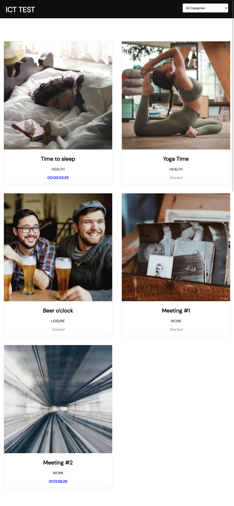
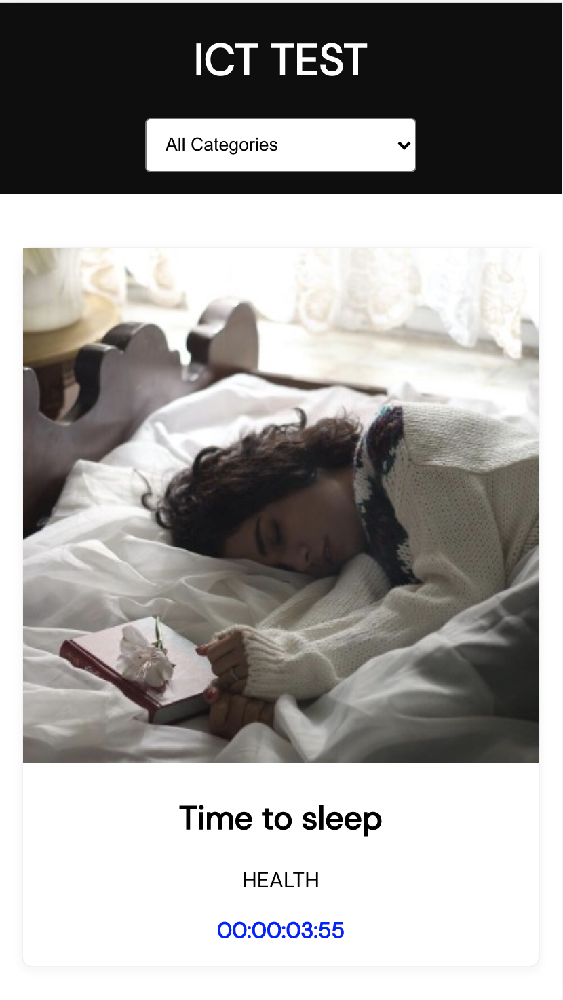

# ICT FE Developer Test Screenshots

## Web

## IPAD

## Mobile

**Required**

- Countdown: The time to start has to tick down every second - **Done**
- Possibility to filter the items based on category - **Done**
- Test your code - **Unit test is done**

**Bonus**

- Synchronize the countdowns to tick at the same time - **Done**
- Visual optimizations - **Done**
- Responsive - **Done**

## Instructions

- Install dependencies: `yarn install`
- Start: `yarn start`

After finishing the Challenge you could provide repo access to:

[@Front End ICT](https://github.com/orgs/ICT-Scandinavia/teams/front-end-ict) - **DONE**
